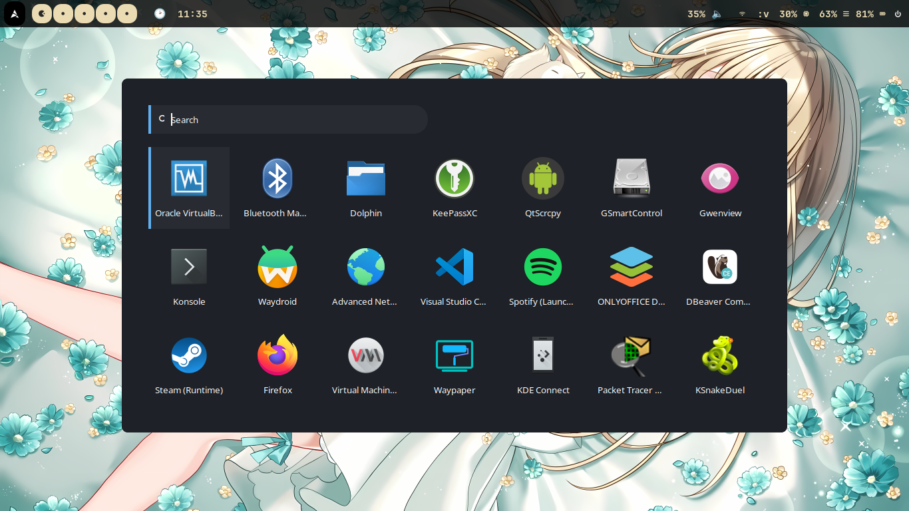

# My dotfiles configuration

## Preview :
### Waybar


### Rofi


## Usage
### 1. Install required dependencies
### Arch based
```
sh -c "$(curl -fsSL https://raw.githubusercontent.com/ohmyzsh/ohmyzsh/master/tools/install.sh)"
yay -S swaync waybar wlogout neofetch hyprlock hyprland stow
```
### 2. Symlink with stow
```
cd hypr-dotfiles
stow --adopt .
```

Trying to be ricer, until my desktop looks good :)